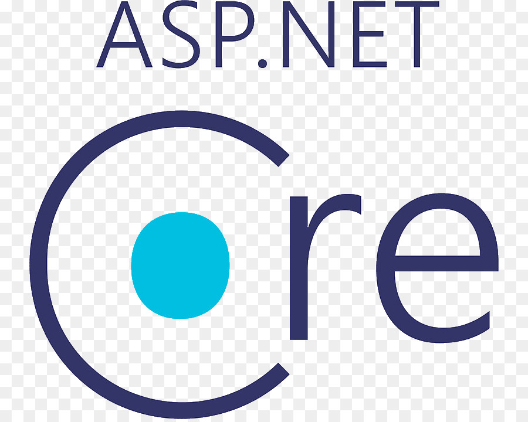
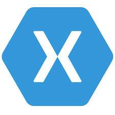

  

## About Me:

- 👨🏼‍💻 I'm a Software Development Student at the University of Cincinnati
- 🚀 I just finished my [portfolio] site and I'm currently working on some personal projects (check out some of my repositories!)
- 🤖 I want to learn more about automation and how I can use it on some of my daily tasks to make life easier
- 📆 I just finished working at London Computer Systems as a Software Developer Intern
- 📧 How to reach out to me: nate10nate@gmail.com
- 📄 My [Resume]

## Skills:

### Languages

 

### Frameworks

 

### Tools

 

##

[Resume]: https://drive.google.com/file/d/1ZjCzsepmwDhFgs12Y2_DtNg8baN_SgUB/view?usp=sharing
[portfolio]: https://nathanburns.dev/
